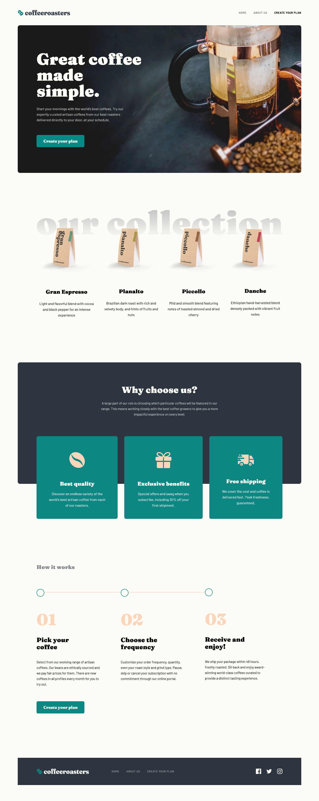

# Frontend Mentor - Coffeeroasters subscription site solution

This is a solution to the [Coffeeroasters subscription site challenge on Frontend Mentor](https://www.frontendmentor.io/challenges/coffeeroasters-subscription-site-5Fc26HVY6). Frontend Mentor challenges help you improve your coding skills by building realistic projects. 

## Table of contents

- [Overview](#overview)
  - [The challenge](#the-challenge)
  - [Screenshot](#screenshot)
  - [Links](#links)
- [My process](#my-process)
  - [Built with](#built-with)
  - [What I learned](#what-i-learned)
  - [Continued development](#continued-development)
  - [Useful resources](#useful-resources)
- [Author](#author)
- [Acknowledgments](#acknowledgments)

## Overview

### The challenge

Users should be able to:

- View the optimal layout for each page depending on their device's screen size
- See hover states for all interactive elements throughout the site
- Make selections to create a coffee subscription and see an order summary modal of their choices

### Screenshot

### Links

- Solution URL: [https://www.frontendmentor.io/challenges/coffeeroasters-subscription-site-5Fc26HVY6/hub](https://www.frontendmentor.io/challenges/coffeeroasters-subscription-site-5Fc26HVY6/hub)
- Live Site URL: [https://coffee-roasters-gamma.vercel.app/](https://coffee-roasters-gamma.vercel.app/)

## My process

### Built with

- Semantic HTML5 markup
- CSS custom properties
- Flexbox
- CSS Grid
- Mobile-first workflow
- [React](https://reactjs.org/) - JS library
- [Next.js](https://nextjs.org/) - React framework
- [Framer motion](https://www.framer.com/motion/introduction/) - For animation

### What I learned

I learned how to use framer motion for basic animation. Like animation on scrolling to reveal section bit by bit.
I progressed in estimation. I estimatede 26 hours to do this project. I did it in 29h, but I didn't plan to add animation so without the animation I'm in time.

### Continued development

I would like to continue to learn framer motion, and add more complex animations. I also want to keep progressing on estimation. I underestimate the 
complexity of the "create your plan" section, because I didn't read at first the requirement in the readme.

### Useful resources

- [React refresher on state](https://www.udemy.com/course/nextjs-react-the-complete-guide/learn/lecture/41161580#overview) - This helped me refresh my knowledge on React State.
- [Framer motion](https://www.framer.com/motion/animation/) 

## Author

- Website - [André-Lubin Thomas](https://www.thomasandrelubin.fr/)
- Frontend Mentor - [@Lordyner](https://www.frontendmentor.io/profile/Lordyner)

## Acknowledgments

Thanks again to the frontendmentor community on Discord ! Always someone to answer questions.